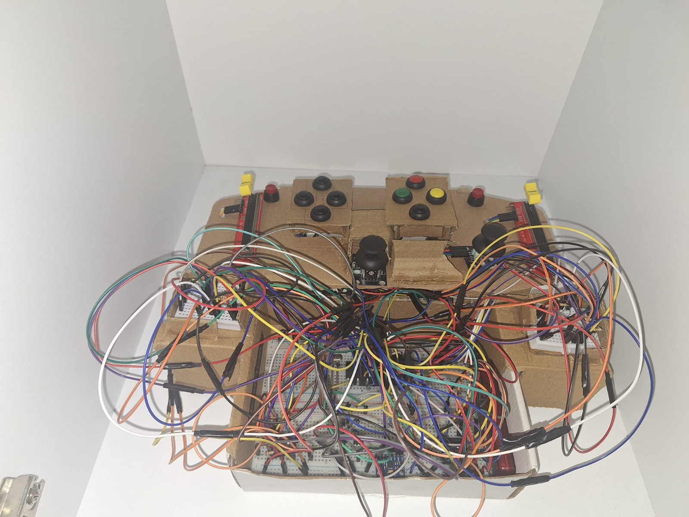

# 🎮 Gamepad Controller System

A custom gamepad controller system developed using the PIC16F877A microcontroller. The project reads joystick, trigger, button, and MPU6050 sensor data and maps the inputs to a virtual Xbox controller through UART communication and a Python interface.

---

## 📹 Demonstration Video

🔗 Project Demo Video

https://drive.google.com/file/d/1Ct43kexfg52BHwquyDdFR6uG3VP4ciMt/view?usp=drive_link

---

## 🚀 Features

- Dual analog joystick support
- Analog trigger inputs
- Push button inputs
- MPU6050 accelerometer and gyroscope integration
- UART communication
- I2C communication
- Virtual Xbox controller support
- Vibration motor feedback
- Proteus simulation
- Hardware implementation

---

## 🔧 Hardware Components

- PIC16F877A Microcontroller
- MPU6050 Accelerometer/Gyroscope Module
- HW-504 (KY-023) Analog Joystick Modules
- Push Buttons
- Vibration Motor
- PC817 Optocoupler
- LM324 Operational Amplifier
- Resistors and Capacitors

---

## 💻 Software Tools

- MPLAB X IDE
- XC8 Compiler
- Python 3
- PySerial
- vgamepad
- Proteus Design Suite

---

## 📁 Repository Structure

| Folder | Description |
|----------|-------------|
| Firmware | PIC16F877A source code and HEX file |
| Python | Virtual Xbox controller application |
| Proteus | Simulation project files |
| Images | Circuit diagrams and project screenshots |
| Report | Project report and documentation |

---

## ⚙️ System Overview

The PIC16F877A microcontroller reads joystick positions, trigger values, button states, and MPU6050 sensor data.

The collected information is transmitted to a computer through UART communication. A Python application receives this data and converts it into a virtual Xbox controller using the vgamepad library.

Force feedback generated by the virtual controller is sent back to the microcontroller, allowing vibration motor control through the motor driver circuit.

---

## 👥 Authors

### Mustafa Haki Karaca
- Student ID: 61230001
- Department: Electrical and Electronics Engineering (EEE)

### Kerim Güler
- Student ID: 61230005
- Department: Electrical and Electronics Engineering (EEE)

---

## 🛠 Technologies Used

- Embedded C
- Python
- UART Communication
- I2C Communication
- PIC16F877A
- MPU6050
- Proteus
- Virtual Xbox Controller Integration

---

## 📚 Course

Microprocessors Course Project
